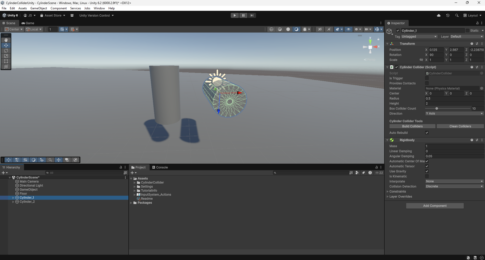

# Cylinder Collider Package

A Unity package that implements a **cylinder collider** using multiple box colliders, including a **custom editor** and a **sample scene**.

---

## Features

- Approximates a cylinder collider using box colliders.
- Custom editor for easy setup and editing in the Unity Editor.
- Sample scene included to demonstrate usage.
- Lightweight and easy to integrate into any project.

---

## Requirements

- Unity 2021.3 or newer
- No additional dependencies

---

## Try it Out

You can download the package and test it in your own project.

---

## Integration

1. [Download CylinderCollider.unitypackage](UnityPackage/CylinderCollider.unitypackage)
2. Open your Unity project and import the downloaded package via **Assets → Import Package → Custom Package…**
3. Add the **CylinderCollider** component to the GameObject you want.
4. Adjust the script parameters to fit your desired collider dimensions.
5. Use the **Auto Rebuild** option to see changes in real time, or disable it and use the gizmo preview to manually rebuild.

---

## Usage Tips

- Use the **custom editor** to visualize the box colliders in the Scene view.
- The more box colliders you use, the smoother the cylinder approximation will be.
- The sample scene demonstrates a basic setup to get you started quickly.

---
